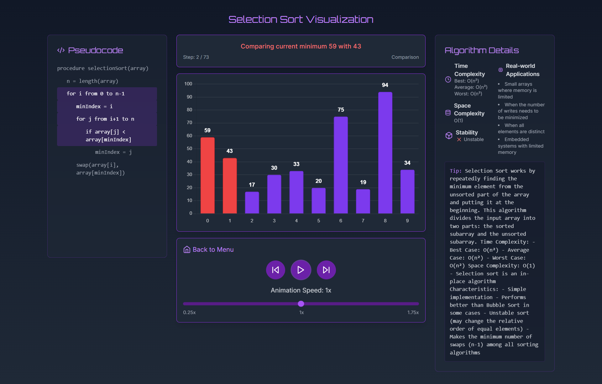

# SortSavvy Visualizer 🚀

A beautiful, interactive sorting algorithm visualizer built with React and TypeScript that helps you understand how different sorting algorithms work through stunning animations and real-time code tracing.



## ✨ Key Features

### 🎯 Interactive Algorithm Visualization
- Real-time visualization of 6 popular sorting algorithms
- Beautiful bar chart animations with dynamic color changes
- Step-by-step execution with forward/backward controls
- Adjustable animation speed (0.25x to 1.75x)
- Visual indicators for comparisons and swaps

### 💡 Live Code Tracing
- Real-time pseudocode highlighting synchronized with visualization
- Line-by-line explanation of what's happening
- Clear indication of current operation (comparison/swap)
- Helps understand the algorithm's logic flow

### 📊 Comprehensive Algorithm Details
- Time and space complexity analysis
- Best, average, and worst-case scenarios
- Real-world applications and use cases
- Stability information
- Detailed algorithm descriptions

### 🎨 Modern UI/UX
- Sleek, dark theme design
- Responsive layout that works on all devices
- Smooth animations and transitions
- Intuitive controls
- Completion celebration effects

## 🔍 Supported Algorithms

1. **Bubble Sort**
   - Simple, stable sorting algorithm
   - Great for educational purposes
   - Best for small datasets

2. **Selection Sort**
   - In-place comparison sort
   - Minimizes number of swaps
   - Useful when memory is limited

3. **Insertion Sort**
   - Efficient for small data sets
   - Adaptive algorithm
   - Works great with nearly sorted arrays

4. **Merge Sort**
   - Divide and conquer algorithm
   - Stable sorting
   - Consistent O(n log n) performance

5. **Quick Sort**
   - Highly efficient for large datasets
   - Widely used in practice
   - In-place sorting

6. **Heap Sort**
   - In-place sorting
   - No quadratic worst-case scenario
   - Efficient for large datasets

## 🛠️ Technical Features

- Built with React 18 and TypeScript
- Vite for lightning-fast development
- Chart.js for smooth visualizations
- Tailwind CSS for modern styling
- Framer Motion for fluid animations
- Lucide React for beautiful icons

## 🚀 Getting Started

1. Clone the repository:
   ```bash
   git clone https://github.com/yash-8923/sort-savvy.git
   ```

2. Install dependencies:
   ```bash
   cd project
   npm install
   ```

3. Start the development server:
   ```bash
   npm run dev
   ```

4. Open your browser and navigate to `http://localhost:5173`

## 🎯 How to Use

1. Select an algorithm from the dropdown menu
2. Click "Start Visualization" to begin
3. Use the control panel to:
   - Play/Pause the animation
   - Step forward/backward
   - Adjust animation speed
4. Watch the code highlighting to understand each step
5. Read the algorithm details for deeper understanding

## 🎨 Design Philosophy

SortSavvy Visualizer was built with three core principles in mind:
- **Educational Value**: Clear visualization and explanation of sorting algorithms
- **User Experience**: Smooth, intuitive interface with helpful controls
- **Visual Appeal**: Modern, professional design with attention to detail

## 🤝 Contributing

We welcome contributions! Please feel free to submit a Pull Request.

## 📝 License

This project is licensed under the MIT License - see the [LICENSE](LICENSE) file for details.


